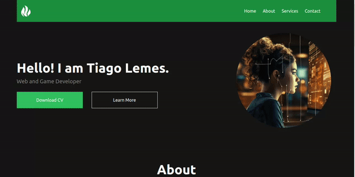

<h1 align="center">Tailwind Animated Portfolio</h1>

  

To make tailwind update the .css file just run

npm run taildDev

<h2 align="center">Mobile Version</h2>  

  

<h2 align="center">Desktop Version</h2>  

  
  

