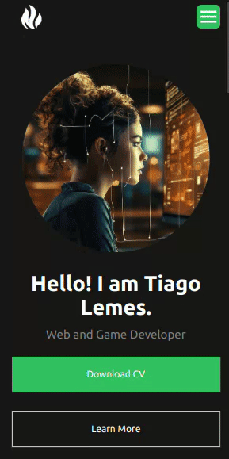

<h1 align="center">Tailwind Animated Portfolio</h1>

  

# Meu Incrível Portfolio Animado feito com Tailwind 🚀✨

Ei, seja bem-vindo ao meu mundo animado de projetos e criatividade! Este é o meu portfólio construído com o Tailwind CSS, repleto de cores, movimento e muita energia! Vamos lá, dê uma olhada! 🌈💻

## Demos! Demos! Demos! 🎥

Passeie por cada projeto no [Cupcakes Software](https://cupcakesoft.com/projetos/tailwind_animated_portfolio) e veja como a magia acontece! Prepare-se para um show de animações e designs envolventes!

## Pré-Requisitos Mágicos 🧙‍♂️

Para experimentar a maravilha deste mundo de animações, você só precisa de um navegador atualizado e curiosidade!

## Como Rodar Meu Mundo Animado 🌟

1. Clone este repositório para o seu computador.
2. Abra o arquivo `index.php` em qualquer navegador moderno.
3. Explore cada página do portfólio e deixe-se levar pela magia dos movimentos!
4. Rode `npm run taildDev` caso queiro adicionar classes Tailwind e atualizar o arquivo estilos.css em tempo real

## Estrutura Encantadora do Projeto 🏰

/
|-- /img             # Imagens e recursos mágicos  
|-- /node_modules    # Pacotes instalados por npm  
|-- /src/css         # Estilos encantadores  
|-- index.php        # Início de tudo  
|-- ...

## Faça Parte Dessa Magia! 🎩✨

Quer contribuir com um feitiço novo? Abra um pull request e vamos transformar este mundo ainda mais incrível juntos!

## Licença para Feitiçaria 📜🔮

Este mundo mágico segue a licença MIT. Para mais detalhes, consulte o arquivo `LICENSE`.

## Fale com o Mago 📬🔔

Quer saber mais sobre os truques e segredos deste mundo? Mande uma coruja ou sinal de fumaça para tiagolemespalhano@gmail.com ou aqui noGithub para uma conversa mágica!

Então, pronto para se encantar? Venha e explore o meu portfólio animado feito com amor, Tailwind e uma pitada de magia! ✨🌟🔮

<h2 align="center">Mobile Version</h2>  

  

<h2 align="center">Desktop Version</h2>  

  
  

